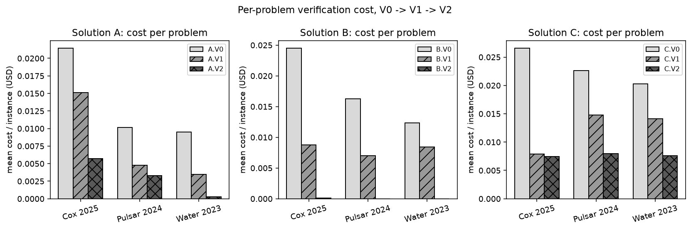
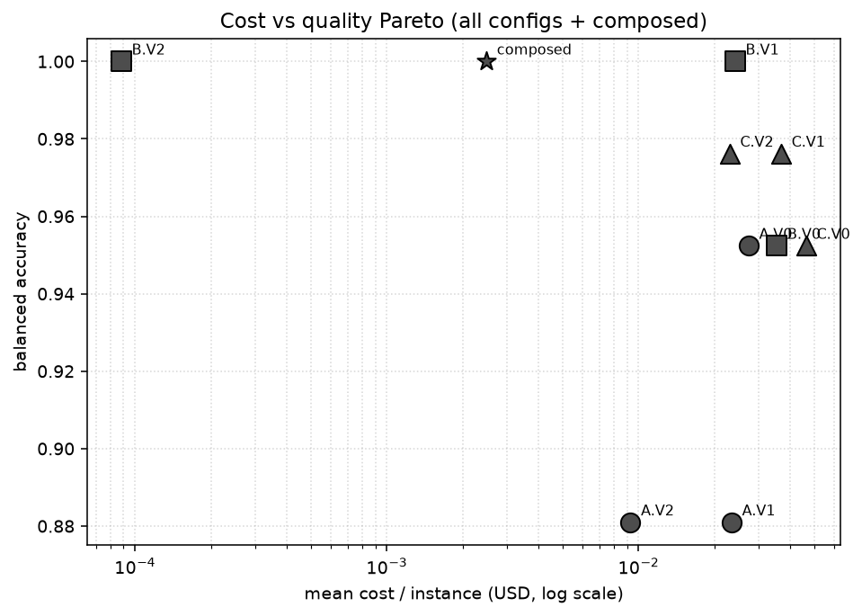
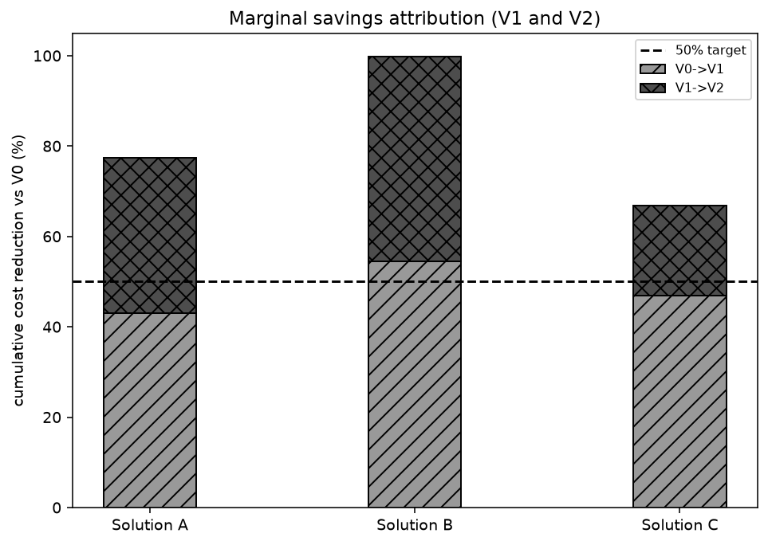

# 50% Cheaper IPhO-Mechanics Verification at Equal Quality

OpenAI-only · total spend $5.48 (<$10)

---

## Headline: per-problem 50% gate

- Solution A: black 68% (PASS), cox 73% (PASS), water 97% (PASS)
- Solution B: black 100% (PASS), cox 100% (PASS), water 100% (PASS)
- Solution C: black 65% (PASS), cox 72% (PASS), water 62% (PASS)

---

## Plots

